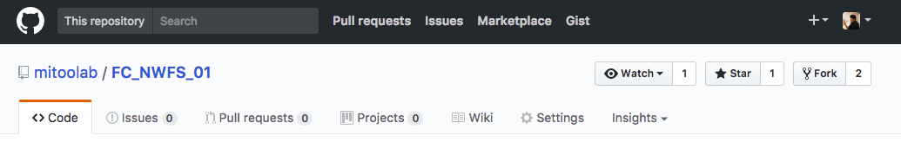

2017.07.24(월)
# fork 후 자료 관리 방법

## 1. github 로그인 후 참여하고자는 github Repository로 이동하여 오른쪽 상단의  `fork`버튼을 클릭한다.  


## 2. 나의 github에 생성된 Repository를 찾은 후 clone 주소를 복사한다.  


### 터미널 활성화 후 작업폴더로 이동한다.

## 3. `내 github에 fork된 Repository의 주소`를 clone 후 해당 폴더로 이동한다.  

- Repository이름으로 폴더 생성  
```
$ git clone http://github.com/myID/Repository이름
```

- 폴더 안으로 이동  
```
$ cd Repository이름
```

## 4. local에 원본(fork를 가져온 Repository) 저장소 주소 등록  
- 원격 저장소(remote)를 upstream(저장소 이름)으로 add 하는 명령어  
```
(master)$ git remote upstream https://github.com//youID/Repository이름
```

- 등록된 원격 저장소를 확인하는 명령어  
```
(master)$ git remote -v
``` 

## 5. `원본(you)` 저장소와 `내(my)` 저장소 data 동기화
- upstream remote repository와(원본 원격 저장소)의 master branch를 내 local repository의 master branch 와 동기화 시킨다.  
- master branch로 동기화 중요!!!  
> master branch가 아닐경우  
> $ git checkout master  
```
(master)$ git pull upstream master
```
- origin remote repository와(내 원격 저장소)의 master branch를 내 local repository와 동기화 시킨다.
```
(master)$ git push origin master
```

## 6. repository내용을 변경할 새 브랜치를 만든다.
- day01 이라는 branch를 만들고 해당 branch로 checkout 한다.
```
(master)$ git checkout -b new
```
- 브랜치 변경 상태에서 파일 생성 및 수정

## 7. 파일 수정 후 origin remote repository(내(my) 원격 저장소)에 올린다.
```
(new)$ git add .
(new)$ git commit -m " 내용 "
(new)$ git push origin new
```

## 8. 내(my) github repository에서 New pull request 버튼을 누른다.


## 9. 원본(you) repository의 master branch 와 내(my) repository의 브랜치를 설정해서 바뀐 내용을 비교할 수 있다.

- 원본 repository의 master branch 와 내(my) repository의 new branch 를 비교

## 10. pull reqeust 생성하기

- title은 commit 메시지로 저장되는 영역  
- write는 해당 commit에 대한 자세한 설명  
- 작성 후 초록색 Create pull request 를 누른다.

---

> 처음 pull request 할 경우 이 순서대로 하고 두 번째 부터는 5~10 단계만 하면 된다.